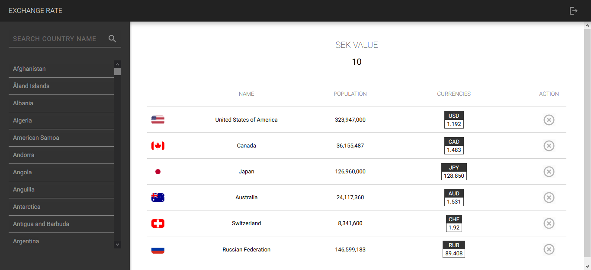

# Exchange Rate of Other Currencies to SEK (Swedish Krona)

This is a test project to check the exchange rate of the currencies of all the countries around the world to SEK, which is the official Sweden currency.

Here you can pick up some countries - by searching them - to see the exchange rate of your desire SEK value to the other currencies.



This project has been implemented as a full-stack project.

The client-side is a Single Web Application that has been implemented with [ReactJS](reactjs.org/) and communicates with the server through [GraphQL](https://graphql.org/).

The Server side is also a [Node.js](https://nodejs.org/) web service that uses [Express.js](https://expressjs.com/) framework along with the [Apollo Server](https://github.com/apollographql/apollo-server/) to serve the GraphQL APIs.

---

## Getting Started

After cloning the whole repository, for running the project in the `development` mode, you can run each side (Server and Client) separately.

### Start the Server

In order to run the Server, first, you need to go to the `./server` directory from the root of the repository.

```bash
cd ./server
```

#### Config the Server

Here there exists a file named `.env.example` which contains some environment variables that are used inside the project.

You should rename it to `.env` and fill the variables.

```bash
mv .env.example .env
```

You can fill the variables with your values or just the sample values below:

```
NODE_ENV = development

PORT = 4000

JWT_SECRET_KEY = 'this is a secret key'

API_ACCESS_TOKEN = 3c23474e9f69222abe48e252563b3aa9

DEFAULT_USERNAME = admin
DEFAULT_PASSWORD = 123456

COUNTRY_API = https://restcountries.eu/rest/v2/name/
RATE_API = http://data.fixer.io/api/latest
```

> *Note: No worries about exposing these values. The APIs are free and this project is just a test project.*

#### Install the Server Dependencies

Now you need to install the Server dependencies by running the following code:

```bash
npm install
```

or

```bash
yarn install
```

After installing the dependencies, the Server is ready to be run.

#### Run the Server

For running the Server there are some scripts in the `package.json` file that you take advantage of them.

Run the project in development mode:

```bash
npm run start:dev
```

*Or use `yarn` if it works better for you*

#### Test the Server

And also there are some integration  tests in the `./tests` directory that you can run them by running this command:

```bash
npm test
```

Now the Server is ready to serve.

### Start the Client

In order to run the Client, first, you need to go to the `./client` directory from the root of the repository.

```bash
cd ./client
```

#### Config the Client

Here there exists a file named `.env.example` which contains some environment variable that is used inside the project.

You should rename it to `.env` and fill the variable.

```bash
mv .env.example .env
```

The only variable here is the URL of the GraphQL server.

You can fill the variable based on your Server config, or just use the sample value below if you have the same config as the sample values here for your Server:

```
REACT_APP_GRAPHQL_SERVER_URL = http://localhost:4000/graphql
```

#### Install the Client Dependencies

Now you need to install the Client dependencies by running the following code:

```bash
npm install
```

or

```bash
yarn install
```

After installing the dependencies, the Client is ready to be run.

#### Run the Client

If you are familiar with the [create-react-app](https://create-react-app.dev/) tool, you probably know about the useful script inside the `package.json` file that you take advantage of them.

Run the project in development mode:

```bash
npm start
```

*Or use `yarn` if it works better for you*

Now the Client is ready, and you can play with that.

> *Note: Use the `username` and `password` that you defined in the `.env` file of the Server*

---

## Project Structure

### Server Directory Structure

```bash
+---src
|   |   app.js                # Express app
|   |   index.js              # Server entry point
|   +---config                # Project and third-party libs configuration
|   +---graphql               # GraphQL related stuff (Controller layer for GraphQl Server)
|   |   +---resolvers         # Includes any kind of Resolver Methods
|   |   |   +---mutation      # Mutations methods
|   |   |   \---query         # Queries methods
|   |   \---schemas           # Schema file (TypeDef)
|   \---services              # Business logic (Service layer)
|       +---auth.service      # Services and helper methods related to authentication
|       \---country.service   # Services and helper methods related to country data
\---tests                     # Includes any kind of tests (Unit & Integeration)
    \---integeration
        \---graphql
```

### Client Directory Structure

```bash
+---public
\---src
    |   App.js                # App components which handle the routing
    |   index.js              # Client entry point and also contains the provider components
    +---assets                # Static files that are imported in the Components
    |   \---images
    +---components            # All the Components of the project
    |   +---AuthProvider      # Provide a Context to track and update the Auth state by other Components
    |   +---Header            # Header of the site (site-name & logout button)
    |   |   \---LogoutButton
    |   +---LoginForm         # Login form for the login page
    |   |   +---ButtonInput
    |   |   +---CheckboxInput
    |   |   \---TextInput
    |   +---ProtectedRoute    # An HOC to wrap the Components (pages) are required authentication to access
    |   +---SEKInput          # The input for entring the SEK value to be converted to the other currencies
    |   +---SelectedList      # The list of selected countries for check their the exchange rate to SEK
    |   +---Sidebar           # The sidebar which is responsible searching and adding the countries to the elected list
    |   |   +---List          # The list of result of the search
    |   |   \---SearchBox     # The input search box
    |   \---Spinning          # Uses to show a spining animation to represent the loading process
    +---graphql               # Includes all the GraphQL queries and mutations
    +---lib                   # Generic libs that can also be used in other projects
    |   +---graphql-client    # A GraphQL client lib which is kind of similar to Apollo-Client that is responsible for sending the graphql requests to the server and serve the responses
    |   +---number-normalizer # A lib to serve valid numbers and separate the digits with comma and fixs the fractional part
    |   \---web-storage       # A lib to make working with localStorage and sessionStorage more easily
    \---pages
        +---HomePage          # The layout to represent the required components on the Home page and track some necessary states
        \---LoginPage         # The layout to represent the required components on the Login page and track some necessary states
```

---

## API Documentation

The API documentation is represented by the Apollo GraphQL Server, and it is accessible via the `/graphql` endpoint.

### GraphQL APIs

List of available APIs:

#### Queries:

```bash
isUserAuthenticated                   # Used for token validation

getCountries($name: String!)          # Used to get the list of countries by their name
```

> *Note: [JWT](https://jwt.io/) is used to generate authentication token.*

#### Mutations:

```bash
login($username: String!, $password: String!)        # Used to login the user and get the token
```
